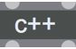

# CHORDFINDER
============

A chord identifier C++ external for Max MSP
============

This external is inspired by the Thesis by Adam Stark "Musicians and Machines: Bridging the Semantic Gap In Live Performance", Queen Mary University - London 2011

I have extended and modified the classes he proposes on github as an implementation of his algorithms, whilst also wrappig the chroma-feature spectrum analysis and the chord detecton into an object that Max MSP can read and use

To work in C++ I have used the MaxCpp template (see below)

The object in Max has stereo signal inlets/outlets acting as a passthrough. 

### inlet messages: 

Bang - resend last chord data on data outlets 

setRMS <float> - this sets a cutoff volume to prevent noise generating random chords.

frame <int> -rate this sets the number of 512 sample frames the Chromagram detector waits before generating a new chromagram. Default is 1 for the most rapid response. Increase this to reduce CPU use. 

###outlet messages:

0 & 2: signal passthrough 

2 : chord name text symbol with the chord name 

3 : chord number this is a 12-bit chord type, plus the root_note value * 10000
e.g D7th would be root note D = 2, * 10000 = 20000, + 2194 = 22194 Em root_note E = 4, * 10000 = 40000, + 2320 = 42320

4 : list of MIDI note values from middle C (60) the note values produce a chord that is the same as the detected chord

5 : RMS cutoff FLAG: this is 0 if the input is below the cutoff value, and 1 if the chord detector is active on the input stream.

## NOTE: 
This is not a self-contained project and should be used in tandem with my MaxCpp within the Max 7 SDK.
To compile iot and use it:

    1) download the SDK from Cycling 74

    2) download [MaxCpp](http://gitlab.doc.gold.ac.uk/fpert041/maxcpp) 

    3) place the SDK within the Max source path

    4) place this repo within the "MyExternals" folder inside MaxCpp

## REFERENCE: 
This project uses the c fft library KISS_FFT, MaxCpp (my update on Graham Wakefield's original), the Chromogram/Chord detector algorithms defined by Adam Stark, as well as the Max 7 SDK (by Cycling '74) -- all the credit for these open-source files should be give to their authors

 

MaxCpp
==========================

## Licence

This version of cordfinder has been built for Max 7 (on the Max 7 sdk) by Francesco Perticarari

chordfinder is distributed under an open-source GNU licence:
( http://www.gnu.org/licenses/ )

Copyright (c) 2016-2017 Francesco Perticarari

Permission is hereby granted, free of charge, to any person obtaining a copy
of this software and associated documentation files (the "Software"), to deal
in the Software without restriction, including without limitation the rights
to use, copy, modify, merge, publish, distribute, sublicense, and/or sell
copies of the Software, and to permit persons to whom the Software is
furnished to do so, subject to the following conditions:

The above copyright notice and this permission notice shall be included in
all copies or substantial portions of the Software.

THE SOFTWARE IS PROVIDED "AS IS", WITHOUT WARRANTY OF ANY KIND, EXPRESS OR
IMPLIED, INCLUDING BUT NOT LIMITED TO THE WARRANTIES OF MERCHANTABILITY,
FITNESS FOR A PARTICULAR PURPOSE AND NONINFRINGEMENT. IN NO EVENT SHALL THE
AUTHORS OR COPYRIGHT HOLDERS BE LIABLE FOR ANY CLAIM, DAMAGES OR OTHER
LIABILITY, WHETHER IN AN ACTION OF CONTRACT, TORT OR OTHERWISE, ARISING FROM,
OUT OF OR IN CONNECTION WITH THE SOFTWARE OR THE USE OR OTHER DEALINGS IN
THE SOFTWARE.
